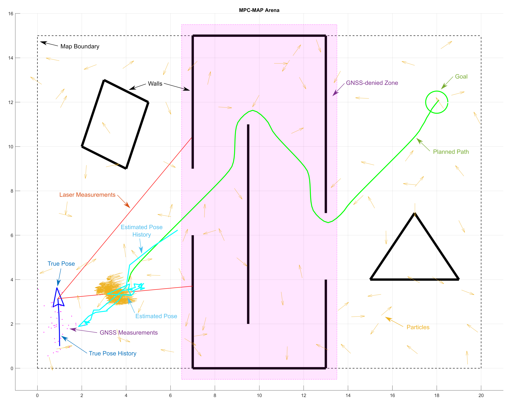

# MATLAB Robot Simulator

The simulator is lightweight, MATLAB-based tool for testing key algorithms utilized for autonomous navigation in mobile robotics. Basically, it integrates differential drive mobile robot model equipped with two different sensors (lidar and GNSS), and  enables to deploy it within custom 2D maps. The main goal is to navigate the robot from start to goal position; for this reason, several algorithms must be implemented:

- **Localization**: two algorithms are needed - for outddor and indoor. The pose may be estimated via Extended Kalman Filter and GNSS data in outdoor areas; for indoor, the algorithm utilizing Particle Filter and known map is more suitable since there is a GNSS denied zone indoor.
- **Path planning**: an algorithm to find optimal, obstacle-free path from the start to goal location (e.g. A* and Dijkstra's algorithms).
- **Motion control**: a control strategy to follow the computed path by using the actual estimated pose. This results in the control commands for the individual wheels.

The simulator has been tested in **MATLAB R2023b**; it may not work correctly in other versions.

## Variables

The simulator uses numerous variables to provide its function; however, not all of them can be used/red to solve the task (the robot's true position, for example). The variables are divided into three groups (structures):

- **Private variables** (`private_vars`): these variables are used in the *main* script only and **not accessible** in modifiable student functions.
- **Read only variables** (`read_only_vars`): these are accessible for your code, but **not returned** to the *main* script. 
- **Public variables** (`public_vars`): feel free to use and **modify** these variables and **add new items** to the structure. The majority of student functions return the structure to the *main* script so you can use it to share variables between the functions. 

Except these variable structures, other variables can occur in your workspace, there is no limit to their use.

## Simulation Loop

The simulator workspace comprise *main* script stored in `main.m`, which contains the main simulator logic/loop and is used to run the simulation (`F5` key). After the initialization part (you are expected to modify the `setup.m` file called in the beginning), there is a `while true` infinity simulation loop with the following components:

1. **Check goal**: check if goal has been reached.
2. **Check collision**: check whether the robot has not hit the wall.
3. **Check presence**: check whether the robot has not left the arena.
4. **Check particles**: check the particle limit.
5. **Lidar measurement**: read the lidar data and save them into the `read_only_vars` structure.
6. **GNSS measurement**: read the GNSS data and save them into the `read_only_vars` structure.
7. **MoCap measurement**: read the reference pose from a motion capture system and save it into the `read_only_vars` structure.  
8. **Initialization procedure**: by default, it is called in the first iteration only; used to init filters and other tasks performed only once.
9. **Update particle filter**: modifies the set of particles used in your **particle filter** algorithm.
10. **Update Kalman filter**: modifies the mean and variance used in your **Kalman filter** algorithm.
11. **Estimate pose**: use the filters outputs to acquire the estimate.
12. **Path planning**: returns the result of your **path planning** algorithm.
13. **Plan motion**: returns the result of your **motion control** algorithm. Save the result into the `motion_vector` variable (`[v_right, v_left]`).
14. **Move robot**: physically moves the robot according the `motion_vector` control variable.
15. **GUI rendering**: render the simulator state in a Figure window.
16. **Increment counter**: modifies read-only variable `counter` to record the number of finished iterations. 

Steps 8 to 13 are located in a separate `algorithms/student_workspace.m` function.

**Warning!** Step 7 is going to be skipped during the final project evaluation. Your solution **must not** rely on MoCap data!

You should be able to complete all the assignments witnout modifying the `main.m` file.

## Custom Functions

You are welcome to add as many custom functions in the *algorithms* folder as you like; however, try to follow the proposed folder structure (e.g., put the Kalman filter-related functions in the *kalman_filter* folder). You may also arbitrarily modify the content (**not header**) of the *student workspace* function (steps 8 to 13 of the simulation loop) and other functions called by it.  

## Maps and testing

The `maps` directory contains several maps in the text file format, which are parsed in real-time when the simulation is started. Use reverse engineering to understand the syntax, and create own maps to test your algorithms thoroughly. In general, the syntax includes the definition of the goal position, map dimensions, wall positions, and GNSS-denied polygons. Do not forget to test various start poses as well (including start angle!); this is adjustable via `start_position` variable (`setup.m`). For the project evaluation, a comprehensive map comprising both indoor and outdoor areas and GNSS-denied zones will be employed.

## GUI

